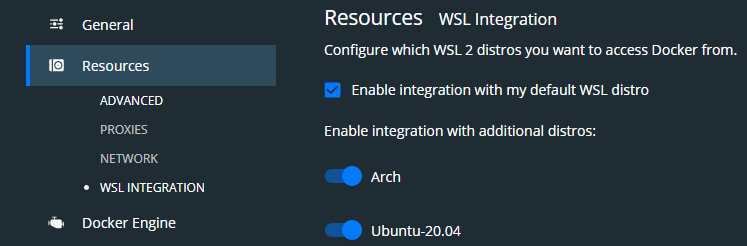

## Install

### Arch-Linux

```make
sudo pacman -Sy && sudo pacman -S git make --noconfirm
git clone https://github.com/Dgame/dgame-system
cd dgame-system && make -f arch.mk [check|install]
```

### Manjaro

```make
sudo pacman -Sy && sudo pacman -S git make --noconfirm
git clone https://github.com/Dgame/dgame-system
cd dgame-system && make -f manjaro.mk [check|install]
```

### Debian

```make
git clone https://github.com/Dgame/dgame-system
cd dgame-system && make -f debian.mk [check|install]
```

### Windows 10 WSL (Debian, Ubuntu 18.04 / 20.04)

- [Installation](https://devblogs.microsoft.com/commandline/install-wsl-with-a-single-command-now-available-in-windows-10-version-2004-and-higher/)
  - `wsl.exe --install`

**or**

- [Documentation](https://docs.microsoft.com/de-de/windows/wsl/install-win10)
  - `dism.exe /online /enable-feature /featurename:Microsoft-Windows-Subsystem-Linux /all /norestart`
  - `dism.exe /online /enable-feature /featurename:VirtualMachinePlatform /all /norestart`
  - `wsl --set-default-version 2`

- [Windows-Terminal Documentation](https://docs.microsoft.com/en-us/windows/terminal/)
  - [Settings.json](https://gist.github.com/Dgame/0504db67cfdcac8d8dea01c633ba4db1)

- Install [FiraCode Nerd Font](https://github.com/ryanoasis/nerd-fonts/releases/download/v2.1.0/FiraCode.zip)

#### Debian

```make
sudo apt-get -y update && sudo apt-get -y install git make
git clone https://github.com/Dgame/dgame-system
cd dgame-system && make -f debian.mk install-on-wsl
```

#### Arch-Linux

```sh
docker pull archlinux
docker create --name Arch archlinux:latest
docker export -o archlinux.tar Arch
wsl.exe --import "Arch" "$PWD/archlinux" "archlinux.tar" --version 2
```

and then configure with

```sh
wsl.exe -d Arch
pacman-key --init
pacman -Syu
useradd -m <username>
passwd <username>
pacman -S sudo vim
export EDITOR=/usr/bin/vim
visudo
...
<username> ALL=(ALL) ALL
...
:wq

pwconv
grpconv
chmod 0744 /etc/shadow
chmod 0744 /etc/gshadow
```

You can enable it by doing

```sh
wsl.exe -d <distro> --user <username>
```

And run the Playbook by doing

```make
sudo pacman -Sy && sudo pacman -S git make --noconfirm
git clone https://github.com/Dgame/dgame-system
cd dgame-system && make -f arch.mk install-on-wsl
```

### Manjaro

```sh
docker pull manjarolinux/base
docker create --name Manjaro manjarolinux/base
docker export -o manjaro.tar Manjaro
wsl.exe --import "Manjaro" "$PWD/manjaro" "manjaro.tar" --version 2
```

and then configure like _Archlinux_.

```make
sudo pacman -Sy && sudo pacman -S git make --noconfirm
git clone https://github.com/Dgame/dgame-system
cd dgame-system && make -f manjaro.mk install-on-wsl
```

### Don't forget to enable the WSL distro in the Docker-Desktop App



----

 - [x] git
 - [x] Fira-Code
 - [x] profanity
 - [x] keepass
 - [x] terminal
   - [x] alacritty
   - [x] tmux
   - [x] taskwarrior
 - [x] shell
   - [x] fish
     - [x] fisher
     - [x] spacefish (prompt) with fisher
   - [x] starship (prompt)
 - [x] editor
   - [x] vim
   - [x] vs-code
   - [x] sublime
 - [x] programming
   - [x] rust
   - [x] php
     - [x] composer
     - [x] php-pear / pecl
   - [x] jetbrains
   - [x] workspace
 - [x] docker
     - [x] docker-compose
 - [x] credentials
 - [x] browser
     - [x] Brave
     - [x] Firefox
